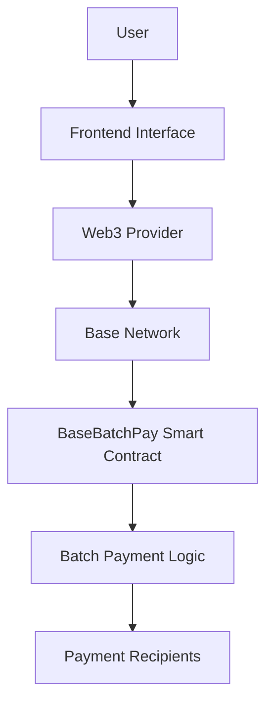

# BatchPay

   

## Table of Contents

- [BatchPay](#batchpay)
  - [Table of Contents](#table-of-contents)
  - [Overview](#overview)
  - [Features](#features)
  - [Architecture](#architecture)
    - [Smart Contract (`solidityContract/`)](#smart-contract-soliditycontract)
    - [Frontend](#frontend)
  - [Prerequisites](#prerequisites)
  - [Installation](#installation)
  - [Usage](#usage)
    - [Smart Contract Development](#smart-contract-development)
    - [Frontend Development](#frontend-development)
  - [Smart Contract Details](#smart-contract-details)
    - [BaseBatchPay Contract](#basebatchpay-contract)
    - [Security Considerations](#security-considerations)
  - [Testing](#testing)
  - [Deployment](#deployment)
    - [Testnet Deployment](#testnet-deployment)
    - [Mainnet Deployment](#mainnet-deployment)
  - [Configuration](#configuration)
    - [Foundry Configuration](#foundry-configuration)
    - [Network Information](#network-information)
  - [Contributing](#contributing)
    - [Code Standards](#code-standards)
  - [License](#license)
  - [Support](#support)
  - [Roadmap](#roadmap)
  - [Disclaimer](#disclaimer)

## Overview

BatchPay is a decentralized application (dApp) designed to facilitate efficient batch payments on the Base blockchain network. This project consists of a Solidity smart contract for handling batch payment logic and a frontend interface for user interaction. The smart contract allows users to execute multiple payment transactions in a single blockchain transaction, reducing gas costs and improving efficiency for bulk transfers.

The project is built using Foundry for smart contract development and deployment, ensuring robust testing and reliable contract interactions. The frontend component provides an intuitive web interface for users to interact with the BatchPay contract, enabling seamless batch payment operations.

## Features

- **Batch Payment Execution**: Send multiple payments to different recipients in a single transaction
- **Gas Optimization**: Reduce transaction costs by batching multiple transfers
- **Secure Smart Contract**: Built with security best practices using OpenZeppelin libraries
- **Testnet and Mainnet Support**: Deployment scripts for both testnet and mainnet environments
- **Comprehensive Testing**: Extensive test suite using Foundry's testing framework
- **User-Friendly Frontend**: Web interface for easy contract interaction
- **Base Network Integration**: Optimized for the Base Layer 2 blockchain

## Architecture



### Smart Contract (`solidityContract/`)
- `BaseBatchPay.sol`: Main contract implementing batch payment functionality
- Deployment scripts for testnet (`BaseBatchPayTestnet.s.sol`) and mainnet (`BaseBatchPayMainnet.s.sol`)
- Test suite (`BatchPay.t.sol`) for comprehensive contract testing

### Frontend
- Web interface for interacting with the BatchPay contract
- Integration with Web3 providers for blockchain connectivity
- User dashboard for managing batch payments

## Prerequisites

Before setting up the project, ensure you have the following installed:

- **Foundry**: For smart contract development and testing
  - Install via: `curl -L https://foundry.paradigm.xyz | bash`
  - Run: `foundryup`
- **Node.js** (version 16 or higher): For frontend development
- **npm** or **yarn**: Package manager for JavaScript dependencies
- **Git**: Version control system

## Installation

1. **Clone the Repository**
   ```bash
   git clone <repository-url>
   cd BatchPay
   ```

2. **Install Foundry Dependencies**
   ```bash
   cd solidityContract
   forge install
   ```

3. **Install Frontend Dependencies**
   ```bash
   # From the root directory
   npm install
   # or
   yarn install
   ```

4. **Set Up Environment Variables**
   Create a `.env` file in the root directory with necessary configuration:
   ```
   PRIVATE_KEY=your_private_key_here
   RPC_URL=https://mainnet.base.org
   ```

## Usage

### Smart Contract Development

1. **Compile Contracts**
   ```bash
   cd solidityContract
   forge build
   ```

2. **Run Tests**
   ```bash
   forge test
   ```

3. **Deploy to Testnet**
   ```bash
   forge script script/BaseBatchPayTestnet.s.sol --rpc-url <testnet-rpc> --private-key <private-key> --broadcast
   ```

4. **Deploy to Mainnet**
   ```bash
   forge script script/BaseBatchPayMainnet.s.sol --rpc-url <mainnet-rpc> --private-key <private-key> --broadcast
   ```

### Frontend Development

1. **Start Development Server**
   ```bash
   npm run dev
   # or
   yarn dev
   ```

2. **Build for Production**
   ```bash
   npm run build
   # or
   yarn build
   ```

3. **Connect Wallet**
   The frontend integrates with Web3 wallets (e.g., MetaMask) for transaction signing and blockchain interaction.

## Smart Contract Details

### BaseBatchPay Contract

The core contract provides the following functions:

- `batchPay(address[] calldata recipients, uint256[] calldata amounts)`: Execute batch payments
- `getPaymentHistory(address user)`: Retrieve payment history for a user
- `withdrawFunds()`: Allow contract owner to withdraw accumulated fees

### Security Considerations

- Uses OpenZeppelin contracts for secure implementations
- Includes reentrancy guards and access controls
- Comprehensive test coverage to prevent vulnerabilities

## Testing

The project includes a comprehensive test suite:

```bash
cd solidityContract
forge test
```

Tests cover:
- Successful batch payment execution
- Gas usage optimization
- Error handling for invalid inputs
- Access control verification

## Deployment

### Testnet Deployment

Use the provided script for Base testnet deployment:

```bash
forge script script/BaseBatchPayTestnet.s.sol --rpc-url https://goerli.base.org --private-key $PRIVATE_KEY --broadcast --verify
```

### Mainnet Deployment

For production deployment:

```bash
forge script script/BaseBatchPayMainnet.s.sol --rpc-url https://mainnet.base.org --private-key $PRIVATE_KEY --broadcast --verify
```

Ensure sufficient funds for deployment and verification fees.

## Configuration

### Foundry Configuration

The `foundry.toml` file contains project configuration:

```toml
[profile.default]
src = 'src'
out = 'out'
libs = ['lib']

[rpc_endpoints]
base_mainnet = "https://mainnet.base.org"
base_testnet = "https://goerli.base.org"
```

### Network Information

- **Mainnet**: Base Mainnet (Chain ID: 8453)
- **Testnet**: Base Goerli Testnet (Chain ID: 84531)

## Contributing

We welcome contributions to the BatchPay project. Please follow these steps:

1. Fork the repository
2. Create a feature branch: `git checkout -b feature/your-feature-name`
3. Make your changes and add tests
4. Run the test suite: `forge test`
5. Commit your changes: `git commit -am 'Add new feature'`
6. Push to the branch: `git push origin feature/your-feature-name`
7. Submit a pull request

### Code Standards

- Follow Solidity style guidelines
- Write comprehensive tests for new features
- Ensure all tests pass before submitting
- Update documentation for API changes

## License

This project is licensed under the MIT License. See the LICENSE file for details.

## Support

For questions or support:

- Open an issue on GitHub
- Check the documentation in the `docs/` directory
- Join our community discussions

## Roadmap

Future enhancements may include:

- Multi-token batch payments
- Scheduled batch payments
- Integration with DeFi protocols
- Mobile application development
- Advanced analytics dashboard

## Disclaimer

This software is provided as-is. Users are responsible for understanding the risks associated with blockchain transactions and smart contract interactions. Always test thoroughly on testnets before mainnet deployment.