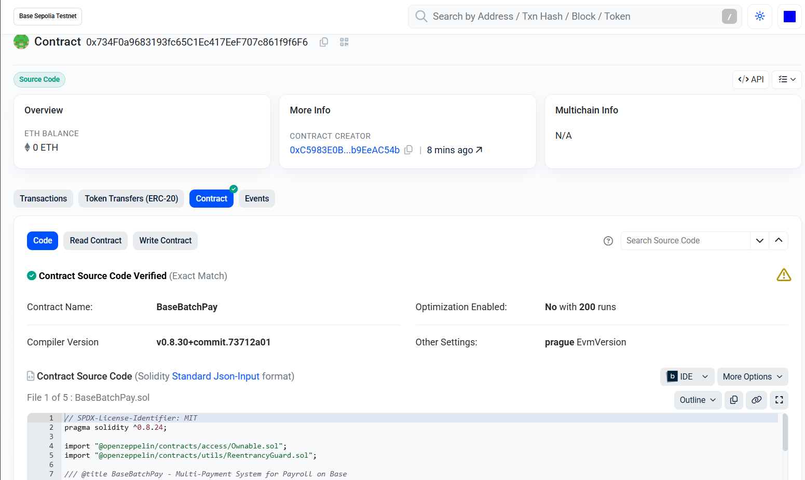
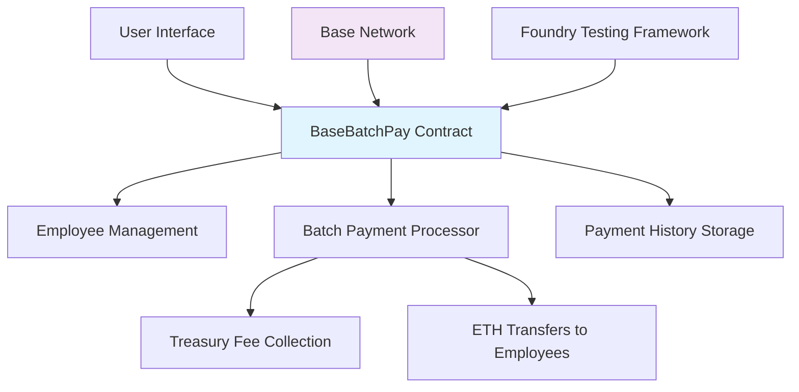
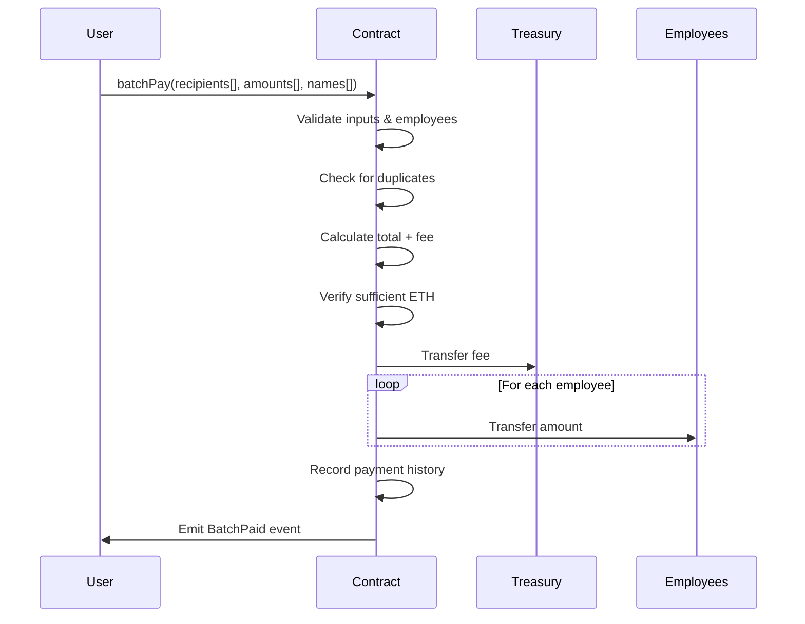

# BaseBatchPay

[](https://getfoundry.sh/)
[](https://soliditylang.org/)
[](https://opensource.org/licenses/MIT)
[](https://base.org/)



A secure, efficient multi-payment system for payroll on the Base network, enabling batch ETH transfers with employee management and a 0.5% fee structure.

## Table of Contents

- [Overview](#overview)
- [Features](#features)
- [Architecture](#architecture)
- [System Design](#system-design)
- [Installation](#installation)
- [Usage](#usage)
- [API Reference](#api-reference)
- [Testing](#testing)
- [Deployment](#deployment)
- [Security](#security)
- [Contributing](#contributing)
- [License](#license)
- [Acknowledgments](#acknowledgments)

## Overview

BaseBatchPay is a Solidity smart contract deployed on the Base Layer 2 network that facilitates secure batch payroll payments. It allows employers to manage employee lists and execute multiple ETH transfers in a single transaction, collecting a 0.5% fee that supports platform sustainability. The contract includes comprehensive security measures, payment history tracking, and prevents common vulnerabilities like reentrancy attacks and duplicate payments.

Key benefits include reduced gas costs for bulk transactions, automated fee collection, and immutable treasury management, making it ideal for DAOs, startups, and organizations conducting regular payroll operations.

## Features

- **Employee Management**: Add and remove employees with granular control
- **Batch Payments**: Execute multiple payments in one transaction with 0.5% fee
- **Security First**: ReentrancyGuard, input validations, and overflow protection
- **Duplicate Prevention**: Ensures no address receives multiple payments in a batch
- **Payment History**: Immutable record of all transactions for auditing
- **Immutable Treasury**: Secure, unchangeable fee collection address
- **Gas Optimized**: Efficient batch processing for cost savings
- **Comprehensive Testing**: Full test suite with edge case coverage

## Architecture

The system follows a modular architecture with clear separation of concerns:



### Components

- **BaseBatchPay Contract**: Core smart contract handling all business logic
- **Employee Management**: Mapping-based system for employee registration
- **Batch Payment Processor**: Handles fee calculation and distribution
- **Payment History Storage**: Immutable transaction records
- **Treasury System**: Automated fee collection mechanism

## System Design

The batch payment flow ensures atomic execution and security:



### Security Measures

- Input validation at all entry points
- Reentrancy protection on payable functions
- Zero-address and zero-amount checks
- Duplicate recipient prevention
- Batch size limits (1-100 recipients)
- Immutable treasury address

## Installation

### Prerequisites

- [Foundry](https://getfoundry.sh/) for development and testing
- [Node.js](https://nodejs.org/) (optional, for additional tooling)
- Git for version control

### Setup

1. Clone the repository:
   ```bash
   git clone <repository-url>
   cd solidityContract
   ```

2. Install dependencies:
   ```bash
   forge install
   ```

3. Build the project:
   ```bash
   forge build
   ```

## Usage

### Basic Workflow

1. **Deploy Contract**: Use deployment scripts for testnet or mainnet
2. **Add Employees**: Register team members using `addEmployee()`
3. **Execute Payments**: Call `batchPay()` with employee details
4. **Monitor History**: Query payment records via `getPaymentHistory()`

### Example Usage

```solidity
// Add employees
contract.addEmployee(employeeAddress1);
contract.addEmployee(employeeAddress2);

// Execute batch payment
address[] memory recipients = [employeeAddress1, employeeAddress2];
uint256[] memory amounts = [1 ether, 2 ether];
string[] memory names = ["Alice", "Bob"];

contract.batchPay{value: 3.015 ether}(recipients, amounts, names);
```

## API Reference

### Core Functions

#### `batchPay(address[] recipients, uint256[] amounts, string[] names)`
Executes a batch payment to registered employees.

**Parameters:**
- `recipients`: Array of employee addresses
- `amounts`: Corresponding payment amounts in wei
- `names`: Employee names for record-keeping

**Requirements:**
- All recipients must be registered employees
- Arrays must have matching lengths
- Sufficient ETH must be sent (amounts + 0.5% fee)

#### `addEmployee(address emp)`
Adds an address to the sender's employee list.

#### `removeEmployee(address emp)`
Removes an address from the sender's employee list.

#### `getPaymentHistory(address payer)`
Retrieves the payment history for a given address.

### Events

#### `BatchPaid(address payer, address[] recipients, uint256[] amounts, string[] names, uint256 fee)`
Emitted when a batch payment is successfully processed.

#### `EmployeeAdded(address payer, address employee)`
Emitted when an employee is added.

#### `EmployeeRemoved(address payer, address employee)`
Emitted when an employee is removed.

## Testing

The project includes comprehensive test coverage using Foundry's testing framework.

### Run Tests

```bash
forge test
```

### Test Coverage

- **Unit Tests**: `test/BatchPay.t.sol` - Basic functionality and error handling (10 tests)
- **Fuzz Tests**: `test/fuzz/BatchPayFuzz.t.sol` - Property-based testing with random inputs
- **Integration Tests**: `test/integration/BatchPayIntegration.t.sol` - Complex multi-user scenarios

### Test Structure

```
test/
├── BatchPay.t.sol              # Unit tests
├── fuzz/
│   └── BatchPayFuzz.t.sol      # Fuzz tests
└── integration/
    └── BatchPayIntegration.t.sol # Integration tests
```

### Running Tests

```bash
# Run all tests
forge test

# Run specific test types
forge test --match-path test/BatchPay.t.sol
forge test --match-path test/fuzz/BatchPayFuzz.t.sol
forge test --match-path test/integration/BatchPayIntegration.t.sol

# Run with gas reporting
forge test --gas-report
```

## Deployment

### Environment Setup

Create a `.env` file in the project root:

```env
BASE_SEPOLIA_RPC_URL=https://sepolia.base.org
BASE_MAINNET_RPC_URL=https://mainnet.base.org
BASESCAN_API_KEY=your_basescan_api_key
TREASURY_ADDRESS=0xYourTreasuryAddress
ACCOUNT=defaultKey
SENDER=0xYourSenderAddress
```

**Note:** The private key is managed through Foundry's keystore system. Use `ACCOUNT=defaultKey` to reference your encrypted keystore file. Foundry will prompt for the password during deployment.

### Testnet Deployment

Deploy to Base Sepolia testnet:

```bash
./deploy_testnet.sh
```

### Mainnet Deployment

Deploy to Base mainnet:

```bash
./deploy_mainnet.sh
```

### Manual Deployment

```bash
forge script script/BaseBatchPayMainnet.s.sol \
  --rpc-url $BASE_MAINNET_RPC_URL \
  --account defaultKey \
  --broadcast \
  --verify \
  --etherscan-api-key $BASESCAN_API_KEY
```

### Verification Example

After successful deployment, the contract will be automatically verified on Basescan:

```
Start verification for (1) contracts
Start verifying contract `0x734F0a9683193fc65C1Ec417EeF707c861f9f6F6` deployed on base-sepolia
EVM version: prague
Compiler version: 0.8.30
Constructor args: 000000000000000000000000c5983e0b551a7c60d62177cccadf199b9eeac54b

Submitting verification for [src/BaseBatchPay.sol:BaseBatchPay] 0x734F0a9683193fc65C1Ec417EeF707c861f9f6F6.
Submitted contract for verification:
        Response: `OK`
        GUID: `baqpqwbve4uxsjytri43wz2r9r8saikqqyl69zwdmsmy851rer`
        URL: https://sepolia.basescan.org/address/0x734f0a9683193fc65c1ec417eef707c861f9f6f6
Contract verification status:
Response: `OK`
Details: `Pass - Verified`
Contract successfully verified
All (1) contracts were verified!
```

**Contract Address (Base Sepolia)**: `0x734F0a9683193fc65C1Ec417EeF707c861f9f6F6`

## Security

### Audit Status

The contract has been designed with security best practices and includes:

- Reentrancy protection via OpenZeppelin's ReentrancyGuard
- Comprehensive input validation
- Overflow protection (Solidity 0.8+)
- Access control through employee management
- Immutable treasury address

### Known Limitations

- Maximum batch size of 100 recipients (gas limit consideration)
- Requires manual employee management
- ETH-only payments (no ERC20 support)

### Security Considerations

- Always verify contract addresses before interaction
- Test thoroughly on testnet before mainnet deployment
- Monitor treasury address for fee collection
- Keep employee lists up-to-date

## Contributing

We welcome contributions from the community. Please follow these guidelines:

### Development Process

1. Fork the repository
2. Create a feature branch (`git checkout -b feature/amazing-feature`)
3. Commit changes (`git commit -m 'Add amazing feature'`)
4. Push to branch (`git push origin feature/amazing-feature`)
5. Open a Pull Request

### Code Standards

- Follow Solidity style guide
- Include comprehensive tests for new features
- Add NatSpec documentation for public functions
- Ensure all tests pass before submitting

### Testing Requirements

- Maintain >95% test coverage
- Include edge case testing
- Gas optimization considerations
- Security-focused test cases

## License

This project is licensed under the MIT License - see the [LICENSE](LICENSE) file for details.

## Acknowledgments

- [OpenZeppelin](https://openzeppelin.com/) for secure contract libraries
- [Foundry](https://getfoundry.sh/) for the development framework
- [Base](https://base.org/) for the Layer 2 infrastructure
- The Ethereum and Solidity communities for ongoing innovation

---

Built with ❤️ for the Base ecosystem. Empowering efficient payroll operations on Layer 2.
